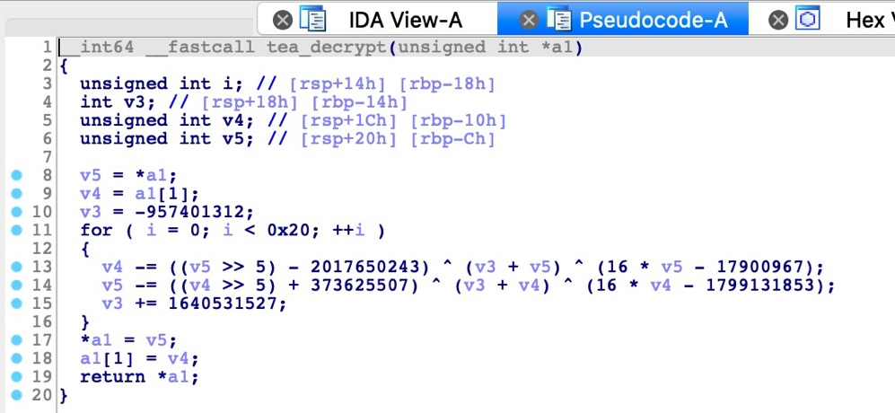
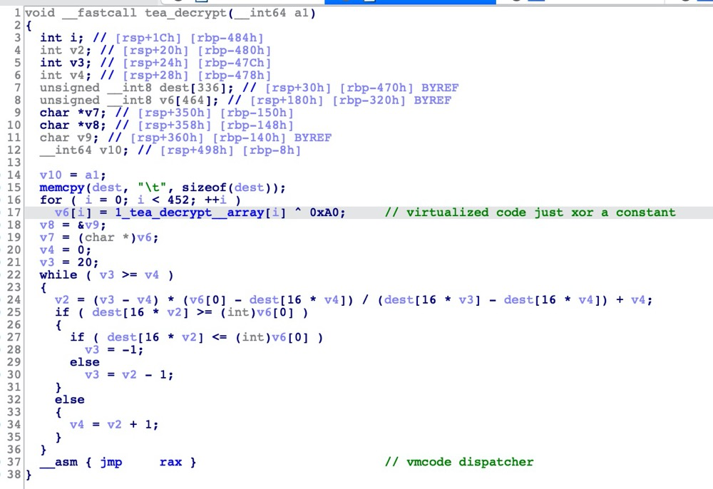
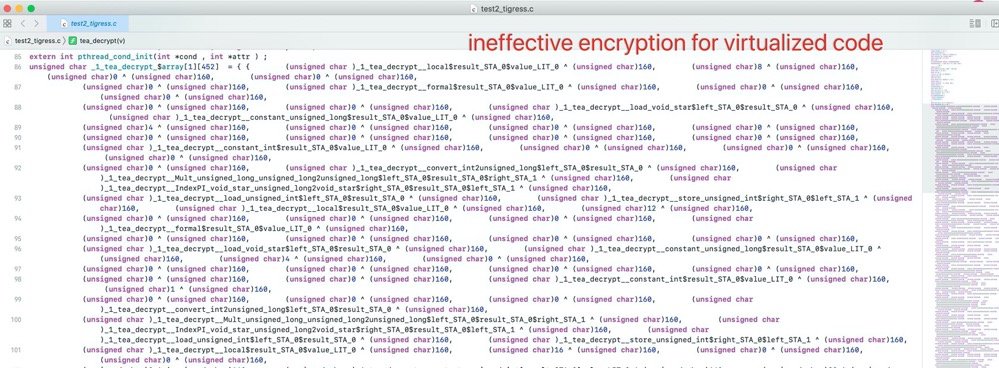
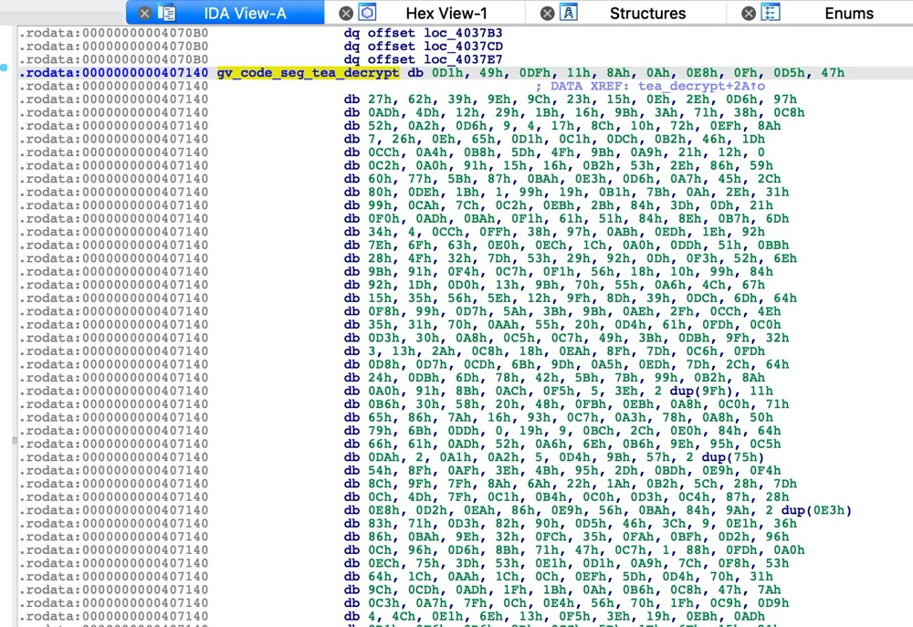
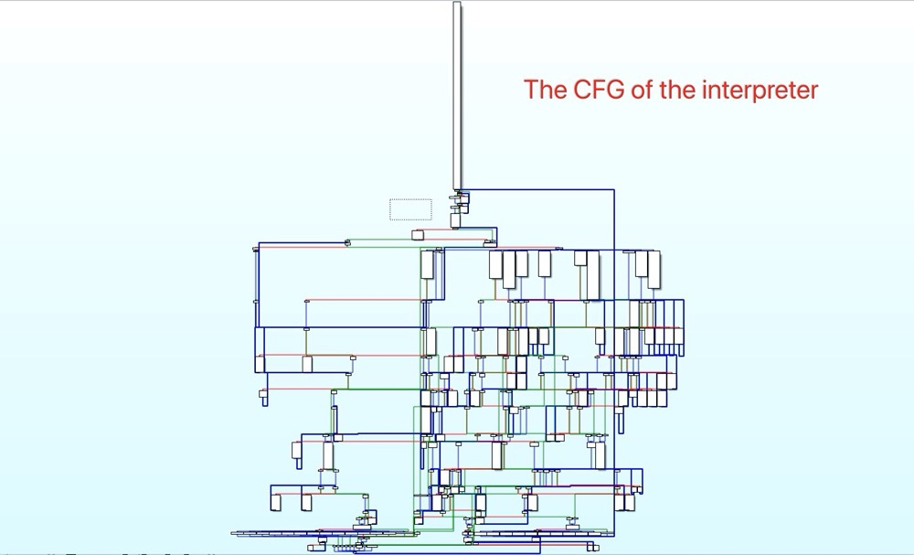
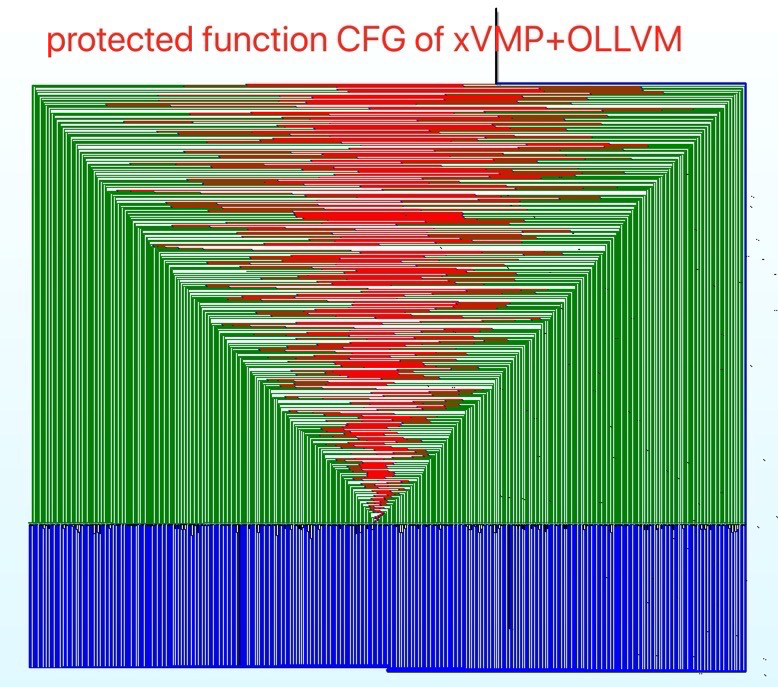

# xVMP

xVMP is an LLVM IR-based code virtualization tool, which fulfilled a scalable and virtualized instruction-hardened obfuscation. It supports multiple programming languages, and architectures. It is also compatible with existing LLVM IR-based obfuscation schemes (such as Obfuscator-LLVM).

xVMP is developer friendly. You only need to add annotations to the to-be-protected function in the source code, and xVMP can perform virtualization protection on the function during compilation.

The website http://xvmp.homes/ which contains the detailed usage document and video is also available.


## Table of Contents

- [Background](#background)
- [Install](#install)
- [Usage](#usage)
- [Examples](#examples)
- [Precautions](#Precautions)
- [Maintainers](#maintainers)
- [Contributing](#contributing)


## Background

Virtualization-based software protection schemes protect the logic and data in the program by converting the original code into a new bytecode based on the custom instruction set architecture (ISA). The new bytecode is emulated via an embedded virtual machine (i.e. interpreter) at runtime. Since a lot of reverse engineering is required for attackers to learn the custom ISA, virtualization obfuscation could hide valuable assets in software.

To meet the requirements in real-world software development, the virtualization obfuscator should achieve the following three goals: 

- i) Strong protection, which means that virtualized code should resist various de-virtualization techniques such as symbolic execution, frequency analysis, etc. 
- ii) Compatibility, which means the virtualization obfuscator should support different source code types, platforms, instruction sets, and various code obfuscation schemes. 
- iii) Ease of use, i.e., developers only need to make simple marks to complete the obfuscation.

Unfortunately, the state-of-the-art virtualization obfuscators cannot fulfill the above requirements. On the one hand, they lack effective protection for virtualization instructions (Tigress only xors a constant for all instructions) and many works in recent years have broken through them by using frequency analysis and symbolic execution. On the other hand, VMProtect and Themida only support virtualize executables on X86 and X64 architectures, and they are not open source. The most advanced academic virtualization scheme Tigress can only support C language source code, and since its input must be a single file containing the full program source code, it is difficult to blend in the software development cycle.

Therefore, we present xVMP, an LLVM-based code virtualization obfuscator fulfills these goals. It incorporates the obfuscation process of code virtualization into the compilation to mask the effects of different architectures and program languages. xVMP generates virtualized code based on LLVM IR and embeds the interpreter of virtualized code into the IR and compiles to an executable. To enhance the security, xVMP encrypts virtualized instructions in each basic block and decrypts them at runtime to enhance the security of obfuscation. In addition, it supports specified function obfuscation. xVMP identifies the function annotations marked by the developer in the source code to locate the function to protect.


## Install

### Prebuilt Binaries

Please download the latest prebuilt binaries from [Release](https://github.com/GANGE666/xVMP/releases).

### Building from source with Obfuscator-LLVM

The code in the master branch is xVMP mixed with obfuscator-llvm based on LLLVM 8.0.

0. Prerequisites. Same as [LLVM building requirements](https://llvm.org/docs/GettingStarted.html#requirements).

1. Use the building script. It will build xVMP and compatible obfuscator-llvm in the `build` directory.

```bash
$ bash ./build.sh
```

### Building as a plugin for LLVM

TBD

### Docker

TBD


## Usage

You only need to add the annotation before the definition of the to-be-protected function. As shown in the following code.

```c
__attribute((__annotate__("vmp"))) 	// add this annotation
void gen_deckey (unsigned char *decrypt_key, char *passwd) {
  // generate decrypt key from the password
}
```

Then compile the source code using the LLVM toolchain with xVMP. 

But please heed these [precautions](#Precautions).


## Examples

We have prepared three examples under the [examples](./examples/) directory to show how to use xVMP.
In these examples, you can use xVMP alone or use xVMP with ollvm to protect specific functions easily, and you can also see the advantages of xVMP over Tigress.

We use `/examples/test/test2` as an example. Part of the source code is shown below.

```c
#ifdef ENABLE_OLLVM
__attribute((__annotate__(("fla"))))
__attribute((__annotate__(("bcf"))))
#endif
#ifdef ENABLE_XVMP
__attribute((__annotate__(("vmp"))))
#endif
uint32_t tea_decrypt (uint32_t* v) {
    uint32_t v0=v[0], v1=v[1], sum=0xC6EF3720, i;  /* set up */
    uint32_t delta=0x9e3779b9;                     /* a key schedule constant */
    uint32_t k0=0x94C36D33, k1=0x164512A3, k2=0xFEEEDA59, k3=0x87BD19BD;   /* cache key */
    for (i=0; i<32; i++) {                         /* basic cycle start */
        v1 -= ((v0<<4) + k2) ^ (v0 + sum) ^ ((v0>>5) + k3);
        v0 -= ((v1<<4) + k0) ^ (v1 + sum) ^ ((v1>>5) + k1);
        sum -= delta;
    }                                              /* end cycle */
    v[0]=v0; v[1]=v1;
    return v[0];
}
```

We will show the protection effects after four compilation schemes: 

- [Original build](####Original build)
- [Tigress protection](####Tigress Protection)
- [xVMP protection](####xVMP Protection)
- [xVMP combined with Obfuscator-LLVM protection](####xVMP+Obfuscator-LLVM)


#### Original build

Use `clang test2.c -o test2` to build an unprotected program. The unprotected programs can be easily analyzed for original logic using reverse engineering tools, like IDA Pro.



#### Tigress Protection

Use `tigress --Environment=x86_64:Linux:Gcc:4.6 --Seed=0  --Transform=Virtualize   --VirtualizeDispatch=interpolation --Functions=tea_decrypt --VirtualizeEncodeByteArray=true test2.c --out=test2_tigress.c` to protect the `test2` with Tigress.

In IDA, we can clearly see that the virtualized code only XORs a constant for protection, which is very easy to be broken. The length of virtualized function is 0x7CA.





#### xVMP Protection

Use `clang -DENABLE_XVMP test2.c -o test2_xvmp `  to protect the `test2` with xVMP.

The virtualization code of program protected by xVMP is more hardened and protected, and the interpreter is more complicated.

The length of function `vm_interpreter_tea_decrypt` is 0x5A71.





#### xVMP+Obfuscator-LLVM

Use  `clang -DENABLE_XVMP -DENABLE_OLLVM test2.c -o test2_xvmp_ollvm`  to protect the `test2` with xVMP and obfuscator-LLVM.

The protection of xVMP+oLLVM makes it more difficult for attackers to be reversed.

The length of function `vm_interpreter_tea_decrypt` is 0x149F2.




## Precautions

- Code optimization. Virtualization is unsound because code optimization may introduces instructions that xVMP cannot handle. So please compile with the `-O0` option, or optimize after xVMP virtualization is complete. Please do not use the `-O3`, `-O2` option.
- Please do not use the `-g` option. Because it will introduce instructions such as `@llvm.dbg.declare`.


## Maintainers

[@G6](https://github.com/GANGE666).

## Contributing

Feel free to dive in! [Open an issue](https://github.com/GANGE666/xVMP/issues/new) or submit PRs.